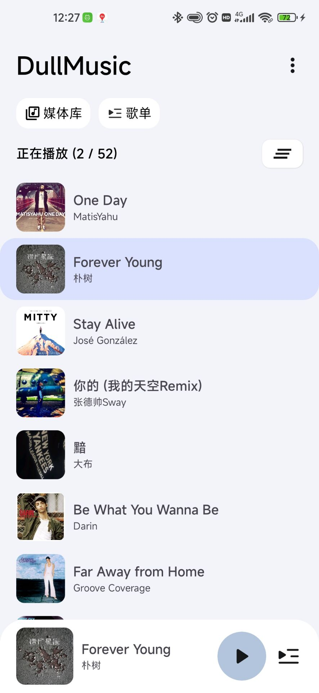
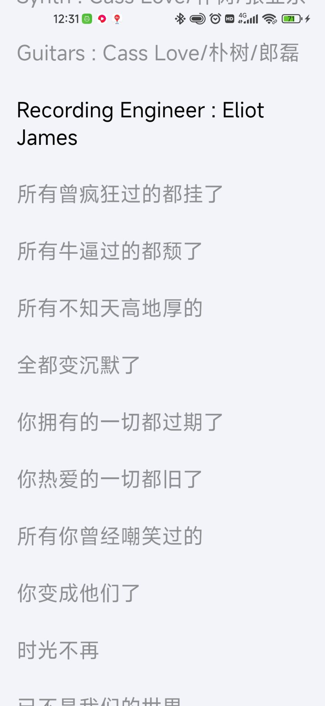
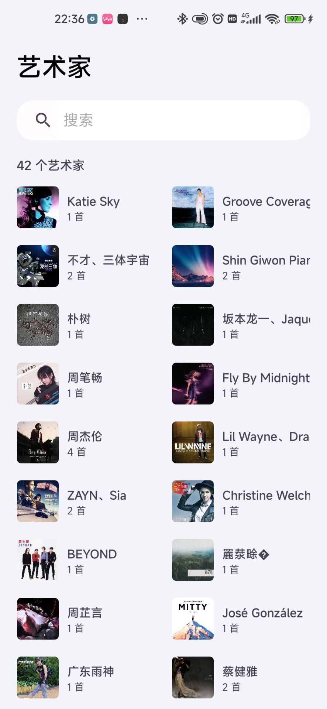

# 音乐

一个听本地音乐的Android应用   

[下载链接](https://www.pgyer.com/5vN0)

# 未来展望

- [x] 主体框架
- [x] 歌词
- [x] 创建和编辑播放列表
- [x] 浏览歌单、专辑、艺术家
- [x] 通知的播放队列

# 截图

|  |   |  |
|:---------------------------------:|:----------------------------------:|:----------------------------------:|
|  |  |  |

# 更新列表

- 2023/02/12  
  完成大体  
  新增歌词  
- 2023/02/13  
  修复滑动歌词时强制回到当前播放位置  
  优化权限判断  
- 2023/02/14  
  完成播放列表   
- 2023/02/15  
  优化代码  
- 2023/02/16  
  横竖屏适配(界面还未完成)  
  完成弹窗播放下一首功能  
  优化代码  
- 2023/02/17  
  歌单(50%)  
- 2023/02/18  
  一个错误的思路导致程序改不回去了,回档  
  完成歌单  
- 2023/02/21  
  完成专辑、艺术家
- 2023/02/22  
  修复部分歌曲无法获取歌词  
- 2023/02/23  
  完成通知栏  
- 2023/02/24  
  修复通知栏切换不更换  
  添加混淆  
- 2023/02/27  
  修复部分歌曲没有专辑图片导致崩溃  
- 2023/04/06  
  适配Android13  
